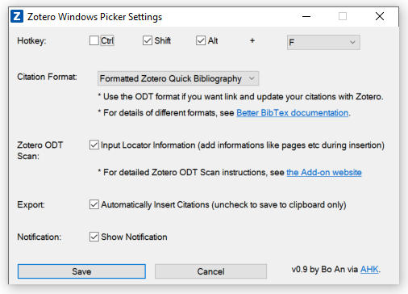
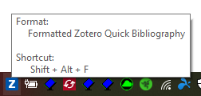

# Zotero Citation Picker for Windows

> An AHK-based windows application to search, pick, and insert Zotero citations.

## Installation

Windows: 

1. Install [Zotero](https://www.zotero.org/download/) for Windows.
2. Install [Better BibTeX for Zotero](https://retorque.re/zotero-better-bibtex/installation/) add-on.
3. Install [RTF/ODF-Scan for Zotero ](https://zotero-odf-scan.github.io/zotero-odf-scan/) add-on.
4. Download [Zotero Windows Picker](https://github.com/boan-anbo/Zotero-Citation-Picker-for-Windows/releases) and run the .exe,
	* Or compile the .ahk file using [AutoHotkey](https://www.autohotkey.com/) compiler.

## Function

1. Connect to [Better BibTeX for Zotero](https://retorque.re/zotero-better-bibtex/installation/). E.g. Insert citations in multiple formats, including formatted Zotero quick citation styles that you choose.
2. Connect to [RTF/ODF-Scan for Zotero ](https://zotero-odf-scan.github.io/zotero-odf-scan/). E.g. Insert citations in ODT format that you can link to Zotero and update the citations live.
3. Support a [ZoteroWinPicker.ico](C:\Users\Bo\Dropbox\NEra\Script\ZoteroWindowsPickerSrc\ZoteroWinPicker.ico) dding locator information for ODT format. E.g. adding page or chapter numbers.
4. Should be able insert Zotero citations everywhere, including Scrivener, Word, Google Docs, etc.
5. Written and compiled with [AutoHotkey](https://www.autohotkey.com/). The .exe should be portable.

## Usage

1. Choose settings when ran for the first time.

3. Use keyboard shortcut to call out Zotero Quick Format Citation window.

4. Search and pick your citation.
5. Insert the citation(s) into the current active window or save to clipboard.
5. Hover or right click the tray icon for more.

## Release History

* 0.9
    * First Version

## License

The MIT License (MIT)

Copyright (c) 2019 Bo An

Permission is hereby granted, free of charge, to any person obtaining a copy of this software and associated documentation files (the "Software"), to deal in the Software without restriction, including without limitation the rights to use, copy, modify, merge, publish, distribute, sublicense, and/or sell copies of the Software, and to permit persons to whom the Software is furnished to do so, subject to the following conditions:

The above copyright notice and this permission notice shall be included in all copies or substantial portions of the Software.

THE SOFTWARE IS PROVIDED "AS IS", WITHOUT WARRANTY OF ANY KIND, EXPRESS OR IMPLIED, INCLUDING BUT NOT LIMITED TO THE WARRANTIES OF MERCHANTABILITY, FITNESS FOR A PARTICULAR PURPOSE AND NONINFRINGEMENT. IN NO EVENT SHALL THE AUTHORS OR COPYRIGHT HOLDERS BE LIABLE FOR ANY CLAIM, DAMAGES OR OTHER LIABILITY, WHETHER IN AN ACTION OF CONTRACT, TORT OR OTHERWISE, ARISING FROM, OUT OF OR IN CONNECTION WITH THE SOFTWARE OR THE USE OR OTHER DEALINGS IN THE SOFTWARE.
