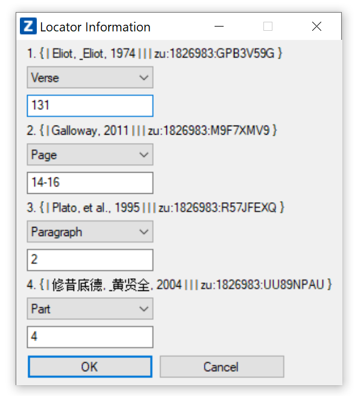
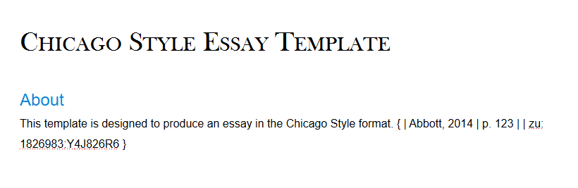

# Zotero Citation Picker for Windows

> An AHK-based windows application to easily search, pick, and insert Zotero citations using keyboard shortcuts.

## Installation

Windows: 

1. Install [Zotero](https://www.zotero.org/download/) for Windows.
2. Install [Better BibTeX for Zotero](https://retorque.re/zotero-better-bibtex/installation/) add-on.
3. Install [RTF/ODF-Scan for Zotero ](https://zotero-odf-scan.github.io/zotero-odf-scan/) add-on. Optional but recommended for live citations update.
4. Download [Zotero Windows Picker](https://github.com/boan-anbo/Zotero-Citation-Picker-for-Windows/releases) and run the .exe,
	* Or compile the .ahk file using [AutoHotkey](https://www.autohotkey.com/) compiler.

## Function

1. Connect to [Better BibTeX for Zotero](https://retorque.re/zotero-better-bibtex/installation/). E.g. Insert citations in multiple formats, including formatted Zotero quick citation styles that you choose.
2. Connect to [RTF/ODF-Scan for Zotero ](https://zotero-odf-scan.github.io/zotero-odf-scan/). E.g. Insert citations in ODT format that you can link to Zotero and update the citations live.
3. Support a [ZoteroWinPicker.ico](C:\Users\Bo\Dropbox\NEra\Script\ZoteroWindowsPickerSrc\ZoteroWinPicker.ico) dding locator information for ODT format. E.g. adding page or chapter numbers.
4. Should be able insert Zotero citations everywhere, including Scrivener, Word, Google Docs, etc.
5. Written and compiled with [AutoHotkey](https://www.autohotkey.com/). The .exe should be portable.

## Usage

1. Choose initial setting for the first run. (If you don't need to manually input the pages numbers etc, turn off the "locator information" option.)

3. Use keyboard shortcut to call out Zotero Quick Format Citation window.

4. Search and pick your citation.

5. When using ODT format, insert locator information, such as pages, chapters, etc.

6. Insert the citation(s) into the current active window or save to clipboard instead.

7. Hover over or right click the tray icon for more.

## Possible Issue

* For the settings to take effect, the app needs admin priviledge to write to an .ini file to store the settings. If you encounter this problem, run it as administrator. Or, download the default ZoteroWindowsPicker.ini (otherwise unnecessary) into the same folder and retry. 

## Release History

* 0.9.1
    * Fixed admin priviledge notice. Longer picker window timeout.

* 0.9
    * First Version

## Prior Work

* On Windows:
	* **[Zotero_scrivener_picker_windows](https://github.com/AmomentOfMusic/Zotero_scrivener_picker_windows)**

* Other intergrations (vim, VS Code, Linux...):
	* Refer to Better BibTex documentation: https://retorque.re/zotero-better-bibtex/citing/cayw/

## License

2019 Bo An
